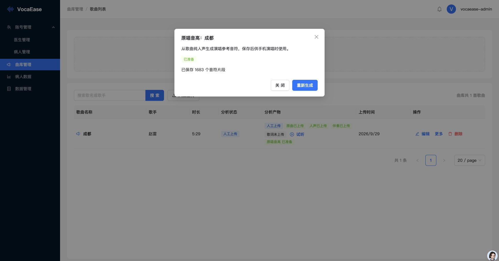

# 歌曲参考音高与演唱音域验证（2026-10-06）

用户确认现有音高链路的局部设计，授权补齐成都真实数据、线上发布与手机覆盖更新。

## 修改与根因

- 缺少参考时旧纵向范围36–84，跨四个八度；实际函数复现三个半音仅移动高度6.25%。新默认16个半音，稳定人声足够后采用最近音高中位数及滞回，避免逐帧缩放。参考就绪时按可信且持续的原唱音符计算持续时间2%–98%音域，左右各留2个半音、最小12个半音；参考横线与患者白点共用半音坐标，边缘留绘制余量。
- 后台已有真实YIN提取与版本存储接口，但资源绑定后未生成，后台无状态与操作入口。新增绑定纯人声后自动排队、原唱音高状态和生成／重新生成弹窗。重复请求复用同一输入的运行任务，空音符不能发布为ready，旧会话固定版本不改动。
- 独立审查指出旧成功版本与新失败版本并存时重试会返回旧版本。真实数据库回归先失败后通过，改为仅复用最新非stale的成功版本；最新失败时创建新任务，保留旧ready供已有会话使用。
- 成都线上原唱、人声、伴奏各328.362630秒。35/90/170/250秒四段包络匹配均为0偏移；随后实际波形以1毫秒步长复核，三轨仍全部0偏移，相关性均超过0.25，依据真实证据登记同一标记35000毫秒。
- 分析输入与线上人声对象大小、七牛分块ETag一致（5357879字节），保留完整性证据。离线真实人声生成1683个片段、174.44秒有声音符，首次18460毫秒、最后290700毫秒；原始MIDI极值36.09–81.35，持续有效范围45.2–66.84。生产生成版本4614433d-9b72-415c-a784-26a5dd9a46f4实际failed，未将其误认为ready。发布后发现Celery JSON传输字符串标识，而真实资源归属验证需要UUID，真实回归复现SourceAssetInvalid；在任务入口恢复UUID，保留完整资源验证与FFmpeg/YIN提取。补充测试修复前失败、修复后通过，581项完整服务端回归通过（32项真实PostgreSQL测试仍跳过），独立复核通过。修复源提交7f6ee98842979616094e52646ca27cd0a61baee1；正式部署后重试新版本b94c5177-dede-467f-83f5-5496ff1e7027，线上状态ready，1683个音符。

## 检查

- 安卓完整354项单元通过，严格离线依赖、lint、正式域名APK构建、权限、无GMS、网络策略、隐私及17响应泛型门禁通过；实际签名APK再检查通过。
- 后台187项完整测试通过；类型、lint、生产构建通过。原唱音高操作测试确认同步双击只创建一次、使用当前人声回执、重新生成明确请求新版本。
- 最终服务端581项完整测试通过，32项依赖真实PostgreSQL环境的测试跳过；云端另行执行真实生产容器迁移与启动检查，不能视为这些跳过测试已执行。接口schema验证无警告。
- 独立只读审查及重试修复复核通过，无剩余重要问题。
- [云端构建与真实容器验证](https://github.com/UnclePluto/VocalEase/actions/runs/37486935193)已成功；源提交015b8d53be685e1a36e28a400c0b89410b59daaa。首次部署[37490706962](https://github.com/UnclePluto/VocalEase/actions/runs/37490706962)通过。队列修复版[37491732966](https://github.com/UnclePluto/VocalEase/actions/runs/37491732966)已成功，包含真实生产容器启动检查。
- APK SHA256：010e849741da68737a6b76f6377d3c57a2730191d72803b49291f24fb85d8a96，证书与当前手机应用一致。

## 发布与真机

手机已于2026-10-06 23:44:29覆盖安装成功，首次安装时间2026-10-06 12:59:55不变；实际安装APK哈希与发布工件一致，未卸载或清数据。系统风险提示由用户在手机上确认。应用当前显示患者登录页，已请用户重新登录后继续实际演唱验收。

最终标签deploy-20261007-pitch-worker、提交7f6ee98842979616094e52646ca27cd0a61baee1，部署[37495364005](https://github.com/UnclePluto/VocalEase/actions/runs/37495364005)已成功。实际后端与后台均核对参考数据ready、1683个音符及0毫秒歌曲/伴奏偏移。公网后台和直连/代理schema返回200，匿名patient/me返回401。

手机安装成功后仍显示患者登录页，用户尚未恢复登录，因此实际演唱中的参考横线滚动与白点真机验收未完成。未创建或提交任何本轮验收录制；不将单元测试或后台截图等同于真机演唱验收。用户登录后从新版重新开始演唱即可继续检查。
